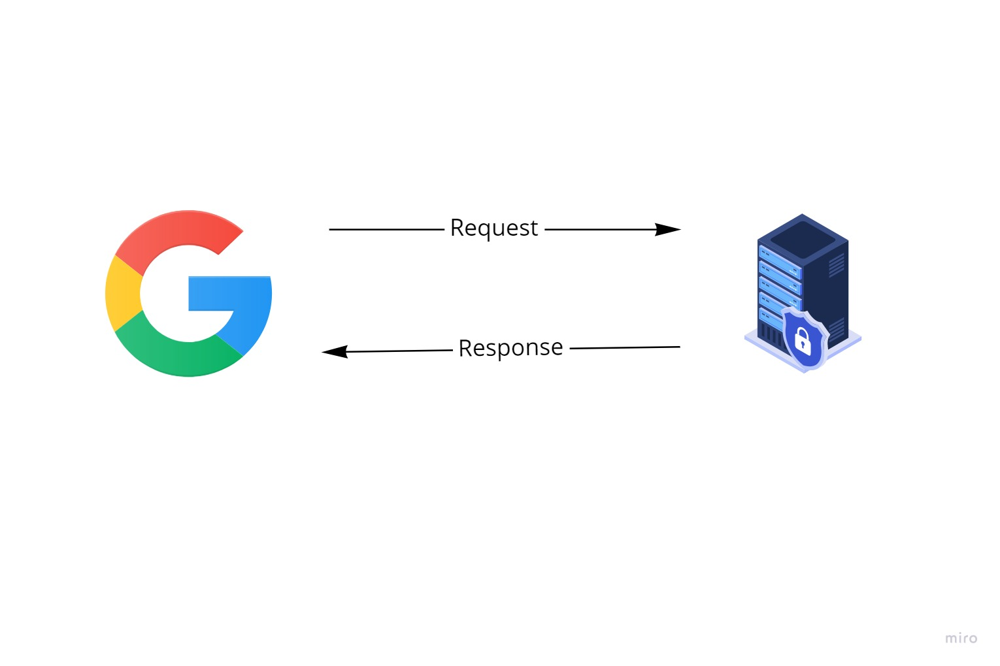
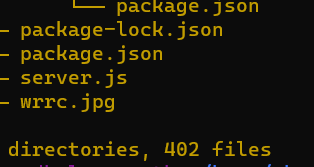
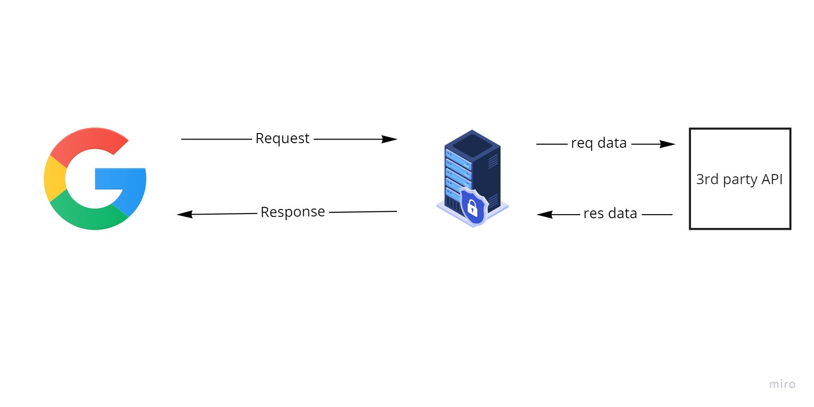
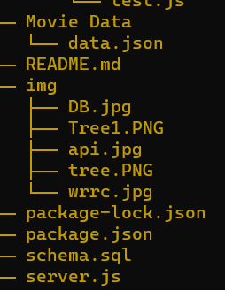
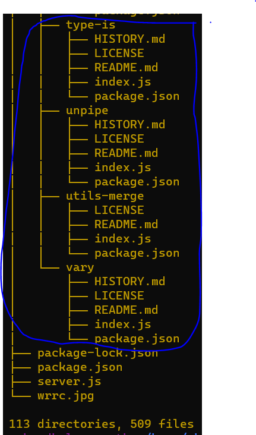
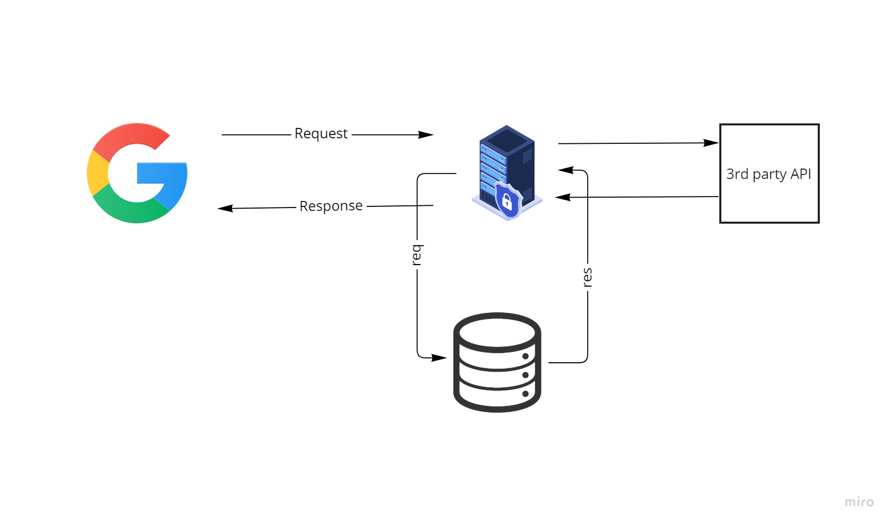

# Movies-Library

# Project Name - Create Server 

**Author Name**: Ahmad Helwa

   ## WRRC

## Overview

## Getting Started
Create a repository

Create a new branch

Create file server.js

Create a repository

Create a new branch

Create file server.js

command "npm init -y" -> add file package.json

Install the required packages -- command npm install express

Create a function error 404 and 500

Create a constructor function

run the server -- command node name js file

## tree 

run the server --  command  node name js file 

## Project Features

What observations or questions do you have about what you’ve learned so far?
nothing

How long did it take you to complete this assignment? And, before you started, how long did you think it would take you to complete this assignment? 2hour 

## Update documentation (12)
 Create a new branch

 Install packages axios dotenv 

 create a file .env and put my ApiKey

 Create functions to handle route from Movie DB Documentation

### Tree in vs

#### Tree in terminal is longer Because of folder node_modules 

What observations or questions do you have about what you’ve learned so far?
nothing

How long did it take you to complete this assignment? And, before you started, how long did you think it would take you to complete this assignment?  8hour 

## Update documentation (13)
Creating the database

create a schema.sql file in my project

Connecting the database with the table (psql -d nameDB -f schema.sql)

pg client library for Node

Save INSERT records to the database (post)

Read SELECT records from the database (get)

### Tree in terminal

What observations or questions do you have about what you’ve learned so far?
nothing

How long did it take you to complete this assignment? And, before you started, how long did you think it would take you to complete this assignment?  4hour 

## Update documentation (14)

 Create  put and delete  requests 

 UPDATE a record in the database

 Delete a record from the database

 Create route getbyID  

.jpg)

What observations or questions do you have about what you’ve learned so far?
nothing

How long did it take you to complete this assignment? And, before you started, how long did you think it would take you to complete this assignment?  2hour 
