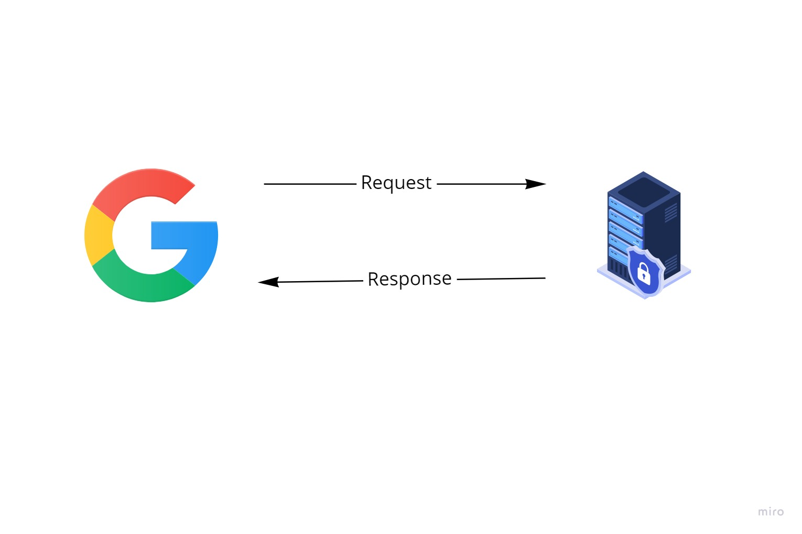

# Movies-Library

# Project Name - Create Server 

**Author Name**: Ahmad Helwa

## WRRC
Add an image of your WRRC here

## Overview

## Getting Started

Create a repository

Create a new branch

Create file server.js

command "npm init -y" -> add file package.json

Install the required packages -- command npm install express

Create a function error 404 and 500

Create a constructor function

run the server -- command node name js file

## tree 

## Project Features

What observations or questions do you have about what you’ve learned so far?
nothing

How long did it take you to complete this assignment? And, before you started, how long did you think it would take you to complete this assignment? 2hour 